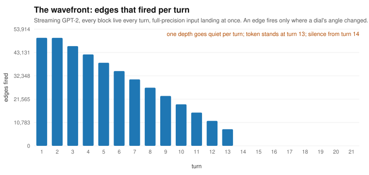
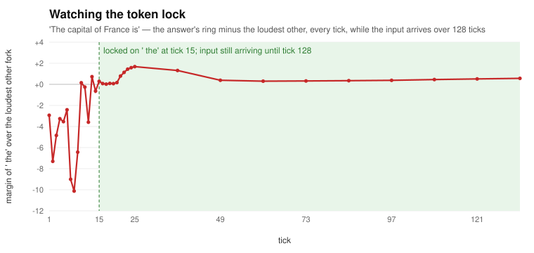

# tick-machine — GPT-2 as notes on a circle

**Every weight a 12-bit angle. Every neuron a pile that superposes what lands on it. Every layer one circular convolution. The whole of GPT-2 as 49 turns of a circle — and the same tokens come out as fp32, on every prompt tried.**

Measured on a MacBook Air (M4), September 2026. Nothing in this repository is a projection: every claim below has a program next to it and a number it produced. The full derivation, step by step, is in **[WRITEUP.md](WRITEUP.md)**.

---

## The idea in four sentences

A weight is a **note**: a position on a circle of 4096, plus a lap counter. Negatives are the complement position — no sign rail. A neuron does not multiply; notes **land** on it and superpose, and what is in tune builds while the rest cancels. The network is **abelian** — order of landings, order of neurons, and starting state all drop out — so depth is not a sequence of steps but how far a landing has spread, and each layer is **one circular convolution** of the input against its rows laid end to end around a circle.

Nature does this without arithmetic (rice falling, light refracting). A computer has no circle to turn, so it *computes* what the circle would leave behind. That is the only reason there is math in these files.

## What was shown

| claim | program | result |
|---|---|---|
| 12-bit angles + laps reproduce fp32 GPT-2 | `edge_model.py`, `gpt2_metal.swift` | **identical**, 5/5 prompts; GPU 161 tok/s |
| every block live every turn; order of firing free; starting state free | `dial_flow_order.py` | **identical**; random order locks *faster* (turn 7 vs 15) |
| the token stands before the input has finished arriving | `dial_flow.py` | locked at tick 15 of 128 |
| between neurons, only edges cross (angle + laps in the timing) | `dial_flow_order.py --stream dial` | **5/5 identical**; one-bit crossings: 1/5 |
| an edge fires only where something changed — then silence | `dial_flow_order.py --input step` | one depth goes quiet per turn, 0 edges from turn 14 |
| no matmul, random flip order, state left standing between tokens | `piles.py` | **identical**, 3 prompts × 8 tokens, ~0.4 s/token |
| the product is *time*: a note is only when its chute opens | `reverse_rotator.py` | right tokens, no note value stored anywhere |
| one layer = one circular convolution, rows end to end on a circle | `turns.py` | max error **2.5e-14**; whole model **identical** |
| the same, with integer notes on a 65 536 circle | `turns_dial.py` | **identical**, 3/3 prompts |
| middle blocks commute (block swaps) | `NOTES.md` | swap or drop any middle block: ~80 % next-token agreement; block 0: 5 % |
| depth-to-depth is one coupling with one scalar gain | `NOTES.md` | exact; runs as one turn on a 9.4 M circle |
| two rungs on a widening circle need no reading between them | `NOTES.md` | exact; the widening is the selection |

<p align="center"></p>
<p align="center"></p>

The hidden state is not hidden here. In the streaming model it is the edge count per turn and the margin per tick — the wave moving through the notes, seen — and when the edges stop, the wave has settled.

## What the model is, in one line

**49 turns, 49 stops.** A turn is one circular convolution against a pattern recorded once. A stop is one of four things that must look at the ring: a water level (a scalar), a bend (pointwise), a limiter over the past (attention), or the final cleanup (the head). Turn, stop, turn, stop — which is the split-step Fourier method physics uses to move a wave through a potential. The recorded pattern is the propagator; the widening cone is the light cone of the input.

## Try it in a minute

```bash
pip install torch transformers numpy          # GPT-2 weights download on first run
python3 -u turns_dial.py --case 0 --n 2       # the model as 49 turns, integer notes on a circle
python3 -u piles.py --case 1 --n 8            # the pile machine, random order, no matmul, ~0.4 s/token
python3 dial_flow_order.py --T 16 --stream dial --input step   # watch the wavefront go quiet
```
Cases 0–2 are the three prompts in `gpt2_dial/reference.json`, with their fp32 greedy continuations as the reference.

## What is *not* here, said plainly

The medium. A rotator does a turn in one rotation however many notes are on the ring; these programs compute the turn in N log N. On this laptop every version pays one note read per landing — 124 M per token — because a chute is a lookup, not a wire. A physical machine's token time is (stops) × (one lap), and that is where "thousands of tokens a second" lives; it lives nowhere in this repository. See §9–10 of the write-up for the numbers.

Also recorded, so nobody re-runs them: the things that were tried and **do not** hold (superposed hypotheses, keyed hypotheses through a dense layer, plinko, feedback across positions, one-bit crossings, GELU removed). §8 of the write-up.

## Read more

- **[WRITEUP.md](WRITEUP.md)** — the whole path, step by step, with the objection-and-answer table at the end
- **[NOTES.md](NOTES.md)** — every measurement in order, with the exact numbers
- **[HRR_MAP.md](HRR_MAP.md)** — the one-to-one map between transformer operations and holographic reduced representations, from the papers
- **[RESEARCH.md](RESEARCH.md)** — who has built what: weight-stationary chips, race logic, time-domain compute-in-memory, delay lines, phasor networks, residue systems

## Author

Parrish Corcoran — idea, framing, and direction. The programs and measurements were built in conversation with Claude (Anthropic), over three days, on one laptop. MIT licensed.
